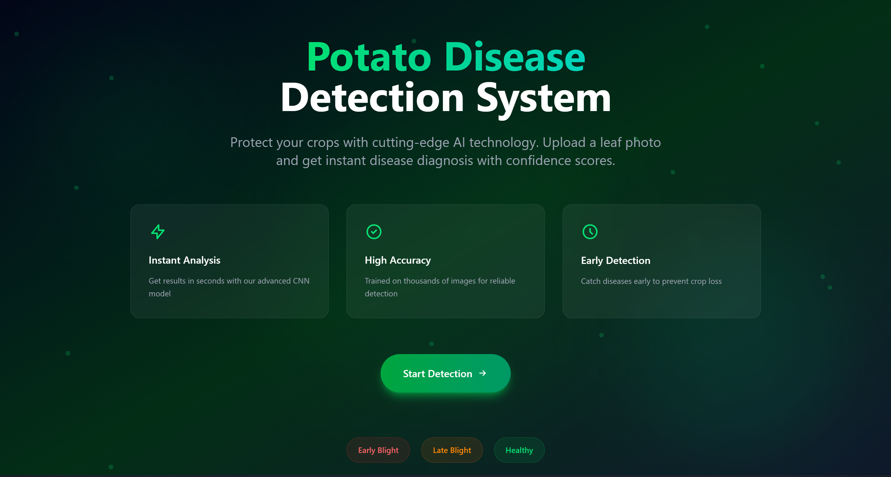
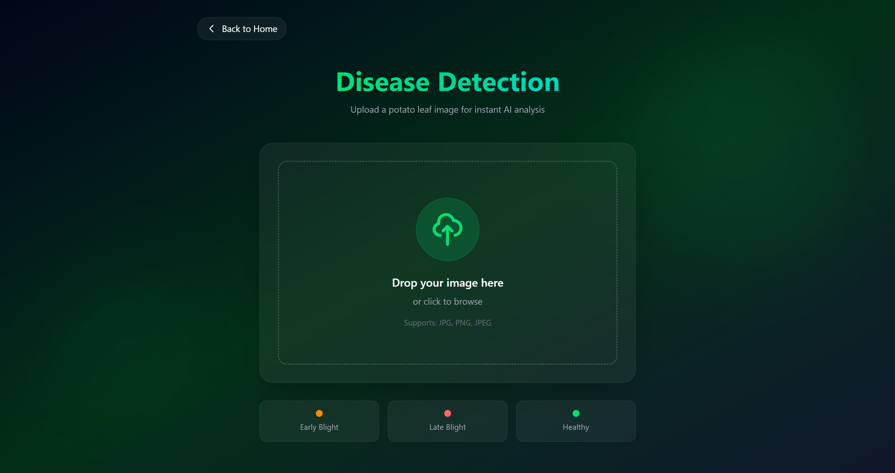
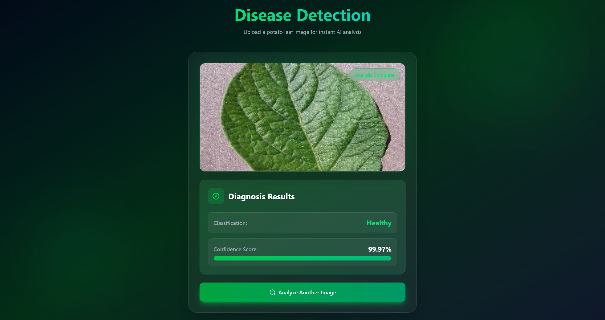

# Potato Disease Classification

<div align="center">



A deep learning-powered web application that detects and classifies potato leaf diseases using Convolutional Neural Networks (CNN). This application helps farmers and agricultural professionals quickly identify potato diseases, enabling timely intervention and treatment.

Model Accuracy = 98%

[](https://reactjs.org/)
[](https://fastapi.tiangolo.com/)
[](https://www.tensorflow.org/)

</div>

---

## Overview

The Potato Disease Classification system uses a trained Convolutional Neural Network (CNN) model to classify potato leaf images into three categories:
- **Early Blight**
- **Late Blight**
- **Healthy**

This application provides a user-friendly interface where users can upload images of potato leaves and receive instant predictions with confidence scores, helping in early disease detection and management.

---

## Features

- **Real-time Prediction**: Upload images and get instant disease classification
- **High Accuracy**: CNN model trained on PlantVillage dataset
- **Confidence Scores**: View prediction confidence for each classification
- **Modern UI**: Clean and responsive interface built with React and Tailwind CSS
- **REST API**: FastAPI backend for easy integration with other systems
- **Image Upload**: Support for various image formats
- **Fast Processing**: Optimized model inference for quick results

---

## Disease Classes

### 1. Early Blight
Early blight is a common potato disease caused by the fungus *Alternaria solani*. It causes dark brown spots with concentric rings on leaves, leading to defoliation and reduced yield.

### 2. Late Blight
Late blight is a devastating disease caused by *Phytophthora infestans*. It appears as water-soaked lesions on leaves and can rapidly destroy entire crops if not controlled.

### 3. Healthy
Healthy potato leaves showing no signs of disease, indicating proper plant health and optimal growing conditions.

---

## Screenshots

### Landing Page

*Clean and intuitive landing page with easy navigation*

### Detection Interface

*Upload and analyze potato leaf images in real-time*

### Prediction Results

#### Early Blight Detection

*Early Blight disease detected with confidence score*

#### Late Blight Detection

*Late Blight disease detected with confidence score*

#### Healthy Leaf Detection

*Healthy potato leaf confirmed with high confidence*

---

## Tech Stack

### Frontend
- **React 19.2.0** - Modern UI library for building interactive interfaces
- **Vite** - Next-generation frontend tooling for fast development
- **Tailwind CSS 4.x** - Utility-first CSS framework for styling
- **React Router DOM** - Client-side routing for navigation

### Backend
- **FastAPI** - High-performance Python web framework
- **TensorFlow/Keras** - Deep learning framework for model inference
- **Uvicorn** - ASGI server for serving the API
- **PIL (Pillow)** - Image processing library
- **NumPy** - Numerical computing for array operations

### Machine Learning
- **CNN Architecture** - Convolutional Neural Network for image classification
- **PlantVillage Dataset** - Training data for potato disease images
- **TensorFlow/Keras** - Model training and deployment

---

## Project Structure

```
Potato Disease Classification/
├── client/                    # Frontend React application
│   ├── public/               # Static assets and screenshots
│   │   ├── Landing.png
│   │   ├── Detection.png
│   │   ├── Early Blight.png
│   │   ├── Late Blight.png
│   │   └── Healthy.png
│   ├── src/                  # Source code
│   │   ├── pages/           # React page components
│   │   │   ├── Landing.jsx
│   │   │   └── Detect.jsx
│   │   ├── App.jsx          # Main application component
│   │   └── main.jsx         # Application entry point
│   ├── package.json         # Frontend dependencies
│   └── vite.config.js       # Vite configuration
├── server/                   # Backend FastAPI application
│   ├── main.py              # API endpoints and model inference
│   └── requirements.txt     # Python dependencies
├── models/                   # Trained models
│   └── potatoes.keras       # CNN model for disease classification
├── training/                 # Model training notebooks
│   ├── model.ipynb          # Training notebook
│   └── PlantVillage/        # Training dataset
│       ├── Potato___Early_blight/
│       ├── Potato___healthy/
│       └── Potato___Late_blight/
└── README.md                 # Project documentation
```

---

## Installation

### Prerequisites

- **Node.js** (v16 or higher)
- **Python** (v3.8 or higher)
- **npm** or **yarn**

### Clone the Repository

```bash
git clone https://github.com/dhruv0050/Potato-Disease-Classification.git
cd Potato-Disease-Classification
```

### Backend Setup

1. Navigate to the server directory:
```bash
cd server
```

2. Create a virtual environment (recommended):
```bash
python -m venv venv
```

3. Activate the virtual environment:
   - **Windows**:
     ```bash
     .\venv\Scripts\activate
     ```
   - **Linux/Mac**:
     ```bash
     source venv/bin/activate
     ```

4. Install Python dependencies:
```bash
pip install -r requirements.txt
```

### Frontend Setup

1. Navigate to the client directory:
```bash
cd ../client
```

2. Install Node.js dependencies:
```bash
npm install
```

---

## Usage

### Running the Backend Server

1. Navigate to the server directory:
```bash
cd server
```

2. Activate virtual environment (if not already activated)

3. Start the FastAPI server:
```bash
python main.py
```

The API will be available at `http://localhost:8000`

- API Documentation: `http://localhost:8000/docs`
- Health Check: `http://localhost:8000/ping`

### Running the Frontend Application

1. Navigate to the client directory:
```bash
cd client
```

2. Start the development server:
```bash
npm run dev
```

The application will be available at `http://localhost:5173`

### Using the Application

1. Open your browser and navigate to `http://localhost:5173`
2. Click on "Detect Disease" or navigate to the detection page
3. Upload an image of a potato leaf
4. View the prediction result with confidence score
5. The model will classify the image as:
   - **Early Blight**
   - **Late Blight**
   - **Healthy**

---

## Model Details

### Architecture
- **Type**: Convolutional Neural Network (CNN)
- **Framework**: TensorFlow/Keras
- **Input Shape**: RGB images (resized to model requirements)
- **Output**: 3 classes (Early Blight, Late Blight, Healthy)

### Training Dataset
- **Source**: PlantVillage Dataset
- **Classes**: 
  - Potato Early Blight
  - Potato Late Blight
  - Potato Healthy
- **Images**: Thousands of labeled potato leaf images

### Model Performance
The model has been trained to achieve high accuracy in classifying potato diseases, providing reliable predictions with confidence scores.

---

## 📡 API Documentation

### Base URL
```
http://localhost:8000
```

### Endpoints

#### Health Check
```http
GET /ping
```
**Response:**
```json
"Hello, I am alive"
```

#### Predict Disease
```http
POST /predict
```

**Request:**
- Method: `POST`
- Content-Type: `multipart/form-data`
- Body: 
  - `file`: Image file (jpg, png, etc.)

**Response:**
```json
{
  "class": "Early Blight",
  "confidence": 0.9876
}
```

**Example cURL:**
```bash
curl -X POST "http://localhost:8000/predict" \
  -H "accept: application/json" \
  -H "Content-Type: multipart/form-data" \
  -F "file=@potato_leaf.jpg"
```

---

## Contributing

Contributions are welcome! Here's how you can help:

1. Fork the repository
2. Create a feature branch (`git checkout -b feature/AmazingFeature`)
3. Commit your changes (`git commit -m 'Add some AmazingFeature'`)
4. Push to the branch (`git push origin feature/AmazingFeature`)
5. Open a Pull Request
---

## Author

**Dhruv**

- GitHub: [@dhruv0050](https://github.com/dhruv0050)
- Repository: [Potato-Disease-Classification](https://github.com/dhruv0050/Potato-Disease-Classification)

---

## Acknowledgments

- **PlantVillage Dataset** - For providing the training data
- **TensorFlow Team** - For the amazing deep learning framework
- **FastAPI Team** - For the high-performance API framework
- **React Team** - For the powerful UI library

---

<div align="center">

**⭐ Star this repository if you find it helpful!**

</div>
